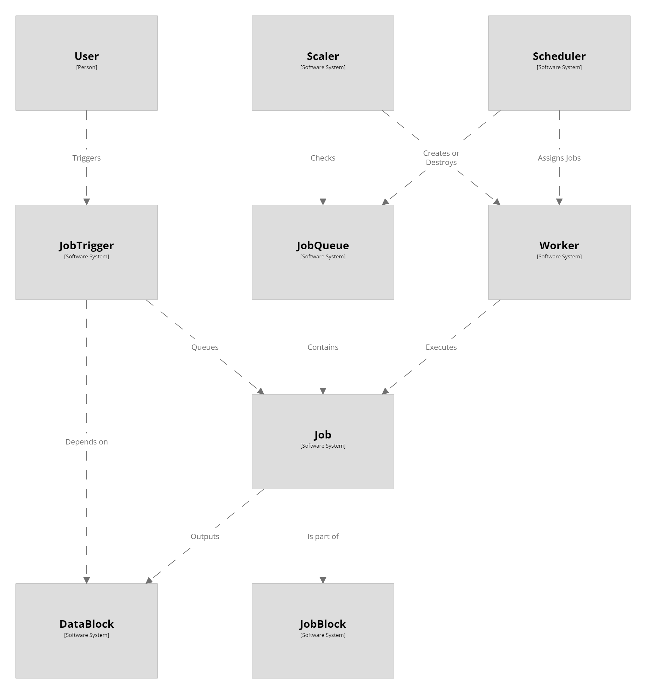

# Concepts

CoreFlow is a highly configurable CI/CD system designed to simplify the automation of your software development workflows. It prioritizes reliability, performance, and extensibility while offering a highly customizable architecture with sensible defaults. Here's an overview of the key concepts:

1. **DataBlock**: A DataBlock is a unit of data that Jobs output as they run. Jobs can depend on these DataBlocks to trigger their execution, which enables dependencies between Jobs to be expressed via data. This setup allows for granular control over the execution order of Jobs while promoting data traceability.

2. **JobTrigger**: JobTriggers are responsible for queuing Jobs based on various criteria such as timers, approval confirmations, or the production of a particular DataBlock. This gives you precise control over when and under what conditions Jobs are queued for execution.

3. **JobBlock**: JobBlocks are higher-level units that encapsulate related Jobs and JobTriggers. They allow you to group Jobs and their triggers into logical units that make sense for your workflows, enhancing manageability and readability.

4. **JobQueue**: The JobQueue is where Jobs wait to be assigned to Workers. Jobs can be reordered or cancelled while in the queue, offering flexibility in managing workloads. Each CoreFlow environment starts with a single "Default" JobQueue, but you can create as many as you need to cater to different needs.

5. **Job**: A Job is a list of steps that a Worker can execute. They can declare parameters and output DataBlocks. Jobs are the core unit of work in CoreFlow.

6. **Worker**: Workers are processes that execute the Jobs assigned to them. They can stream performance data and logs back to CoreFlow and can switch between environments without downtime, contributing to a resilient CI/CD system.

7. **Scheduler**: Schedulers assign Jobs from one or more JobQueues to Workers. They decide the assignment based on different configurations and Job metadata. A default Scheduler is always present, but you can create custom Schedulers for finer control.

8. **Scaler**: Scalers monitor one or more JobQueues to create or destroy Workers based on the demand. They enable CoreFlow to adapt to workload changes dynamically and efficiently.

By understanding these concepts and how they interrelate, you can effectively model your workflows and adapt CoreFlow to your needs. With its intuitive design, CoreFlow makes it easy to understand your CI/CD processes while providing extensive customization options. The sensible defaults allow you to get started quickly, while the flexible configuration options ensure the system can evolve with your needs.

    
    </img>

