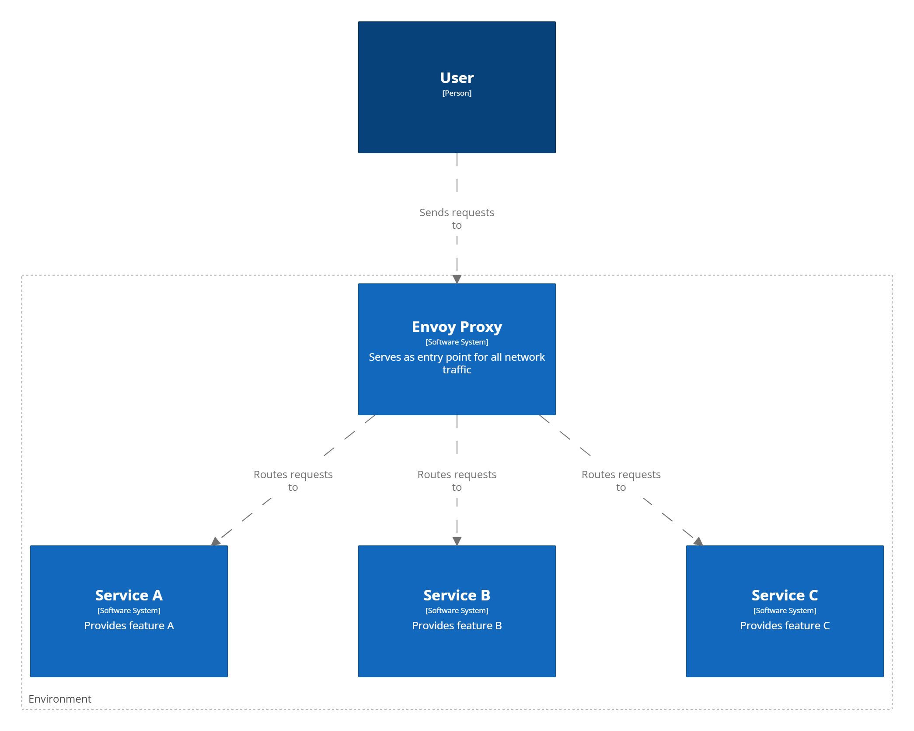

# Envoy as a Proxy

The use of Envoy as a reverse proxy in front of each CoreFlow Environment significantly contributes to the overall performance and scalability of the system.

In this architecture, Envoy serves as the entry point for all incoming network traffic intended for any of the services in a CoreFlow Environment. Each service is an independent application running in its own container, offering a specific feature of the CoreFlow system.

When a request is made to a specific URL, say https://coreflow-env.com/service-a, Envoy accepts the request and routes it to the appropriate service based on the path in the URL. All services remain hidden behind Envoy, which handles all communication between the client and the services.

This setup enhances the security of the system, as it minimizes the surface area exposed to the internet. It also offers load balancing benefits, as Envoy can distribute the network load across multiple instances of each service, if they are available.

    
    </img>

