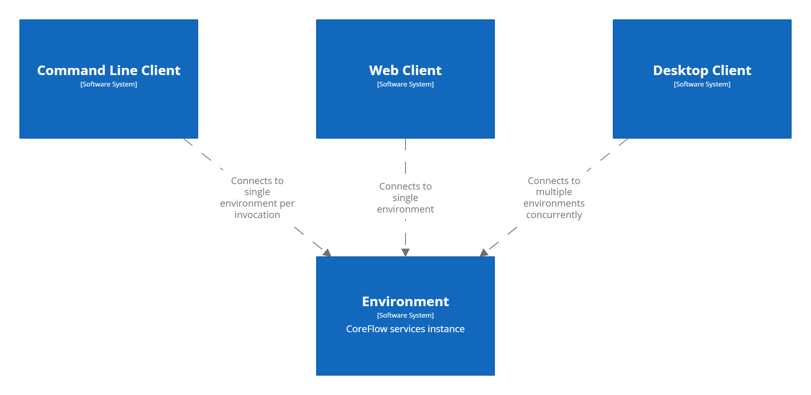

# Multi-Environment Design of CoreFlow

CoreFlow is designed as a versatile and scalable CI/CD system, accommodating multiple configurations known as "Environments". Each Environment is a separate instance of CoreFlow services with its own configurations and operational parameters, creating an isolated space for CI/CD processes. This allows distinct project ecosystems, independent teams, or even different stages of the same project (such as development, staging, and production) to coexist without interfering with one another.

This powerful design philosophy ensures effective resource management, isolation of tasks, and provides a higher degree of flexibility and adaptability. It allows users to switch between various Environments based on their needs, enabling more efficient development workflows.

## Client Types

To ensure seamless interaction with these Environments, CoreFlow provides three types of clients:

1. **Command Line Client**: Ideal for developers who prefer working with terminal-based interfaces, the Command Line Client provides a robust way to interact with a single Environment at a time. It maintains a list of configured Environments, and allows users to set a default environment for their operations. If needed, the default can be overridden during each invocation with an environment variable or command-line argument, making it incredibly flexible for different workflows.

2. **Web Client**: The Web Client is designed for simplicity and convenience, providing an easy-to-use, browser-based interface to interact with a single Environment. It is particularly useful for quick access to job results, status checks, and build logs, without needing to worry about other Environments.

3. **Desktop Client**: The most feature-rich of the three, the Desktop Client allows concurrent connections to multiple Environments. It uses a tab-based interface to manage these connections, and it remembers the configured Environments for future sessions. It also provides authentication mechanisms for all connected Environments, offering a comprehensive CI/CD management tool on your desktop.

    
    </img>

